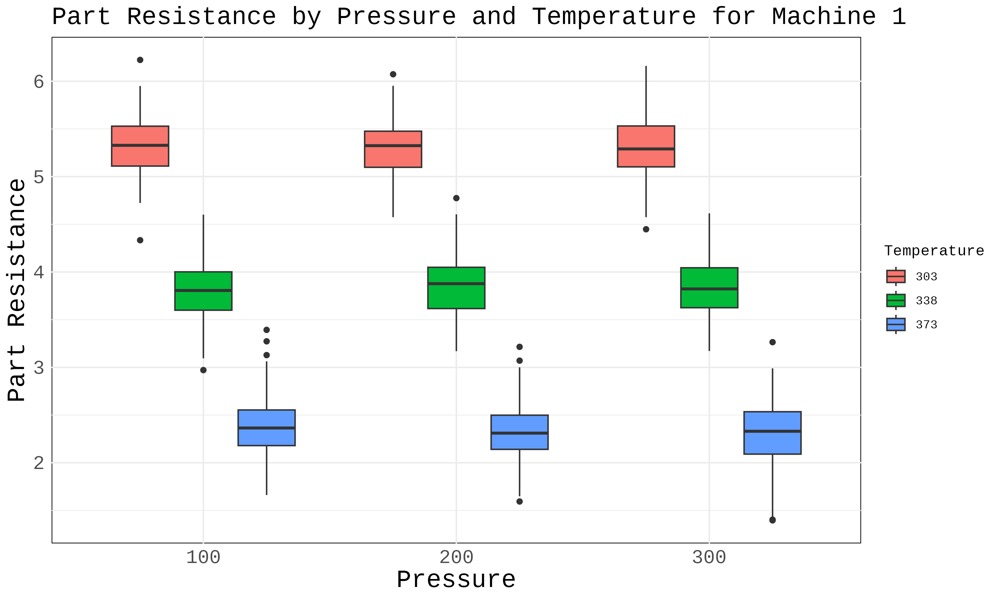

:::: {.columns}
::: {.column width="50%"}

## Assignment 3 Presentation
#### Suwetha A/P S Raman Naidu
#### Universiti Malaysia Perlis
#### [s241042546@studentmail.unimap.edu.my](mailto:s241042546@studentmail.unimap.edu.my)

<!-- __AUDIO_INTRO_DO_NOT_TOUCH__ -->

:::

::: {.column width="50%"}

:::

::::
---

  

  ## ANOVA: Part Resistance (Machine 1)

  ANOVA for Part Resistance (Machine 1), examining pressure, temperature, and interaction effects.

  - **Pressure:** P=`0.8476` (not significant).
  - **Temperature:** P=`0.0000` (significant).
  - **P*T Interaction:** P=`0.0822` (not significant).

  *Conclusion:* Both pressure and temperature significantly affect Part Resistance. Optimize conditions to minimize resistance.

  

  

    
  

